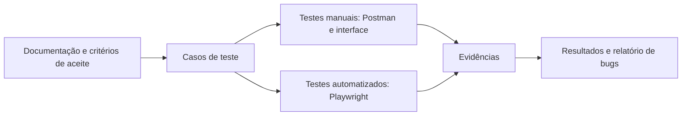
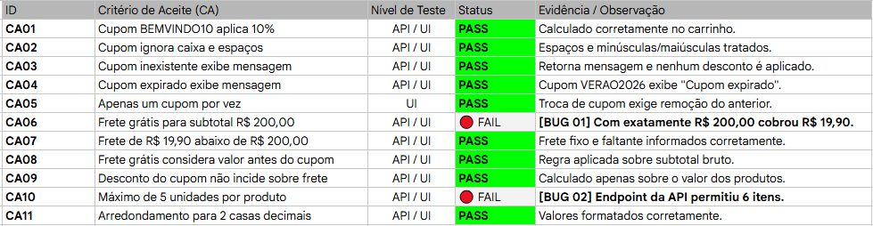

# Entrega de QA — Verzel Store

## Sobre a entrega

Este repositório apresenta a validação funcional da Verzel Store, uma loja fictícia criada para o processo seletivo de QA da Verzel. O desafio é testar a aplicação de cupons, o cálculo de frete e a finalização do pedido, verificando critérios de aceite tanto pela interface quanto pela API.

- [Documentação oficial do desafio](https://verzel-store.qa-test-verzel-store.workers.dev/documentacao)
- [Aplicação sob teste](https://verzel-store.qa-test-verzel-store.workers.dev/)
- [Casos de teste e resultados](docs/casos_teste.md)
- [Relatório de bugs e sugestões](docs/bugs_encontrados.md)

A documentação oficial descreve 11 critérios de aceite, as regras de cálculo, os dados de teste e os endpoints disponíveis. A entrega reúne casos manuais, automação com Playwright, especificação OpenAPI para importar no Postman e evidências.

## Preparar o ambiente

Pré-requisitos: Git, Node.js e npm. O Visual Studio Code é recomendado para navegar pelo projeto, mas não é obrigatório.

```bash
git clone https://github.com/pcdajr/teste_tecnico_Verzel.git
cd teste_tecnico_Verzel
npm install
npx playwright install
code .
```

`code .` abre a pasta no VS Code, se o comando estiver disponível. Também é possível abrir a pasta pelo menu do editor.

### Postman

1. Abra o Postman e selecione **Import**.
2. Importe `evidencias/postman/postman_collection.json`. O arquivo contém uma especificação OpenAPI que o Postman converte em uma collection.
3. Importe as variáveis de ambiente
4. Envie as requisições de consulta de produtos, cálculo do carrinho e criação do pedido. Os exemplos e resultados também estão nas pastas de evidências.

### Playwright

A aplicação e a API deste desafio já estão hospedadas. Este repositório contém os testes, não o código-fonte da loja; portanto, não há comando para iniciar a API ou a interface localmente. Os testes acessam o ambiente remoto.

No terminal integrado do VS Code ou em outro terminal, na pasta do projeto:

```bash
# Executar o teste automatizado de consulta da API
npx playwright test tests/api/buscar/CT_API_01.spec.js --project=chromium

# Executar os testes automatizados da interface
npx playwright test tests/e2e --project=chromium

# Abrir o modo interativo do Playwright
npm run test:ui

# Executar todos os testes em todos os navegadores configurados
npx playwright test

# Abrir o relatório HTML da execução
npx playwright show-report
```

O Playwright está configurado para Chromium, Firefox e WebKit. O modo interativo facilita executar e depurar os testes durante a apresentação.

## Organização do projeto

```text
docs/
  bugs_encontrados.md       Relatório de bugs e sugestões
  casos_teste.md            Cenários, critérios verificados e resultados
  ca_resultado.png          Visão consolidada dos critérios de aceite

evidencias/
  api(screenshots)/         Capturas das consultas e requisições da API
  postman/
    postman_collection.json Especificação OpenAPI importável no Postman
    postman_environment.json Ambiente Postman (BASE_URL a configurar)
  ui(screenshots)/          Capturas e gravação dos testes da interface

tests/
  api/buscar/               Teste automatizado de consulta de produtos
  e2e/carrinho/             Testes de cupom e regra de frete
  e2e/finalizar/            Testes de checkout e validação de campos

playwright.config.ts        Configuração dos projetos e navegadores
package.json                Dependências e comandos npm
```

## Fluxo de validação



## Resultados e métricas

Os resultados registrados nos documentos da entrega são:

| Medição | Aprovados | Reprovados | Total |
|---|---:|---:|---:|
| Critérios de aceite (CA01–CA11) | 9 (81,8%) | 2 (18,2%) | 11 |
| Casos de teste documentados | 10 (83,3%) | 2 (16,7%) | 12 |

Os dois critérios reprovados são o frete grátis no valor exato de R$ 200,00 (CA06) e o limite de cinco unidades por produto na API (CA10). Os casos detalhados e seus status estão em [docs/casos_teste.md](docs/casos_teste.md). As métricas acima refletem os resultados documentados na entrega.

### Bugs identificados

| Bug | Severidade | Resumo |
|---|---|---|
| BUG 01 | Média | O frete de R$ 19,90 continua sendo cobrado quando o subtotal é exatamente R$ 200,00. |
| BUG 02 | Alta | A API aceita seis unidades do mesmo produto, embora o limite definido seja cinco. |
| BUG 03 | Baixa | O campo de nome completo aceita números e caracteres especiais; achado em teste exploratório. |

### Sugestões de melhoria

1. Aplicar a regra de frete grátis para subtotal maior ou igual a R$ 200,00 e cobrir os valores imediatamente abaixo, no limite e acima dele.
2. Validar o limite de quantidade na API e na interface, com testes para cinco e seis unidades.
3. Validar o nome completo de forma consistente na interface e no servidor.
4. Após as correções, executar novamente os testes e registrar novas evidências de regressão.

## Evidências

As imagens e a gravação completas estão em [evidencias/](evidencias/). Abaixo, alguns exemplos dos resultados registrados:

**Critérios de aceite**



**Requisição de cálculo do carrinho no Postman**

/post(postman)/Carrinho + calcular/cupom valido.PNG>)

**Validação de campos obrigatórios no checkout**

/teste campo vazio checkout.PNG>)

**Gravação do teste de cupom**

[Assistir à gravação do teste de cupom e diferenciação entre maiúsculas e minúsculas](<evidencias/ui(screenshots)/teste de cupom e case sensitive (textbox).mp4>)
