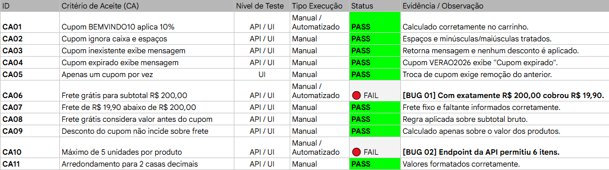

## 📋 Relatório de Validação | Verzel Store

ENTREGA ATUAL - Cupom de desconto e frete grátis  
Card VZS-142  
Versão 2.3.0  

Resultado da válidação dos critérios de aceite

#### Report de Bugs e Sugestões de Melhorias🔴 

**BUG 01**: 
*[Severidade: Média | Prioridade: Média]* 

**Critério Afetado**: CA06 ("O frete é g0rátis para compras com subtotal a partir de R$ 200,00, inclusive").
**Comportamento Esperado**: Subtotal de R$ 200,00 deve resultar em Frete R$ 0,00. 
**Comportamento Obtido**: O sistema manteve a cobrança de R$ 19,90.   
**Sugestão de Correção**: Na regra da API (/api/carrinho/calcular), alterar a condição relacional de subtotal > 200 para subtotal >= 200.

**BUG 02**: 
*[Severidade: Alta | Prioridade: Alta]* 

**Critério Afetado**: CA10 ("Cada produto pode ter no máximo 5 unidades por pedido. A regra vale para a interface e para a API").
**Comportamento Esperado**: A API deve rejeitar o payload com HTTP 400 Bad Request se algum item tiver quantidade > 5. 
**Comportamento Obtido**: A requisição POST /api/finalizar_pedido aceitou 6 unidades e retornou 200 OK.   
**Sugestão de Correção**: Validar na variável quantidade para garantir que não acontece novamente.
